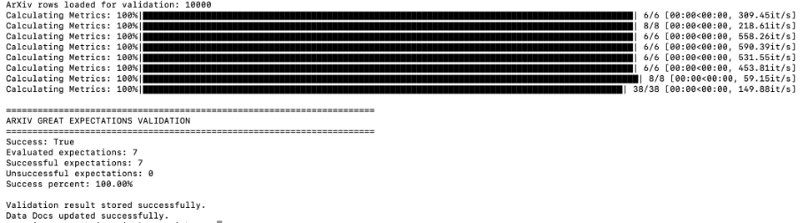
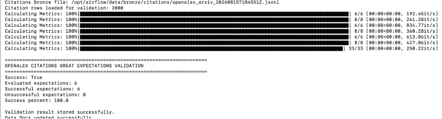
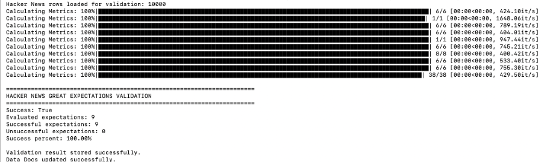
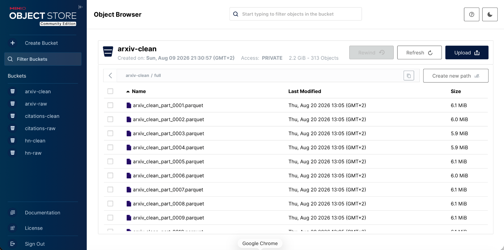
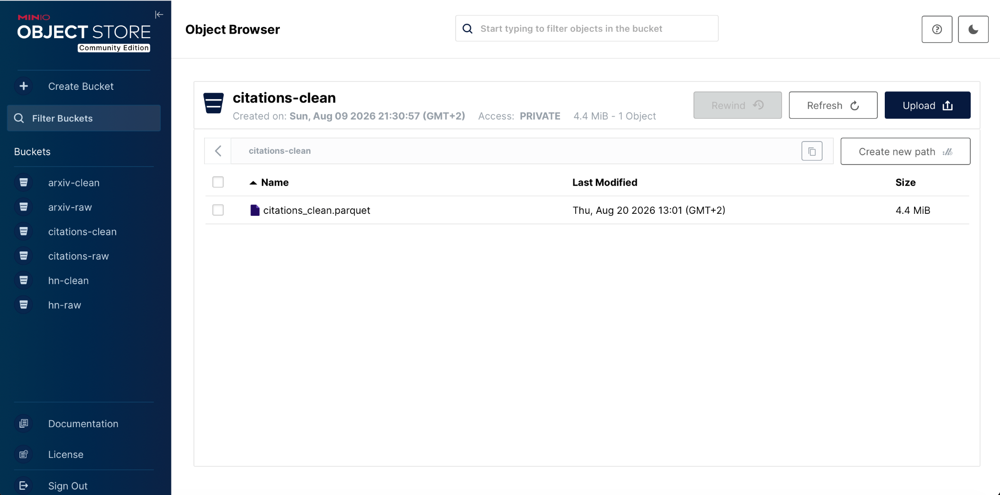
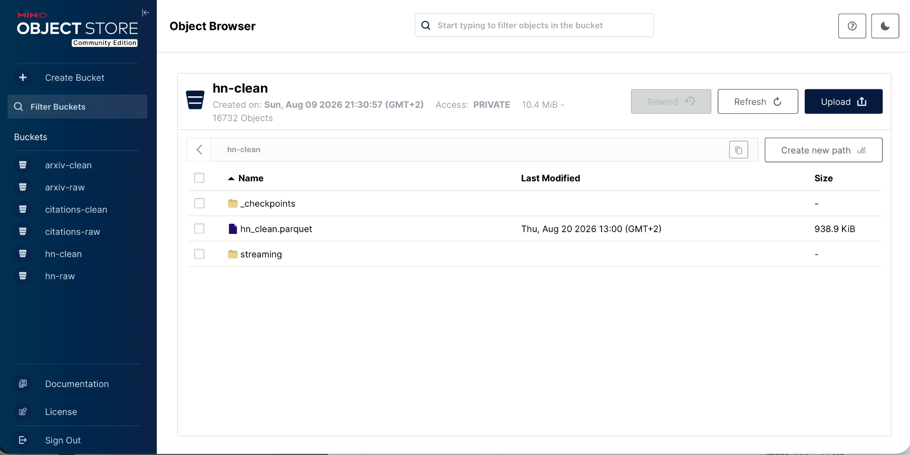
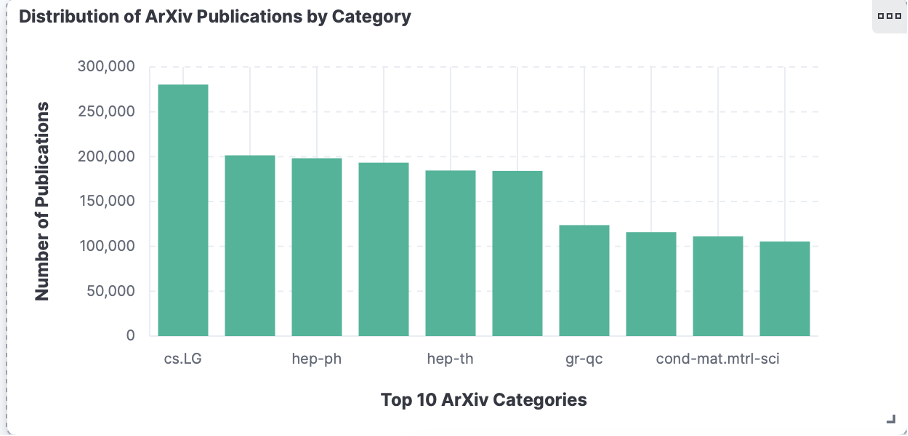
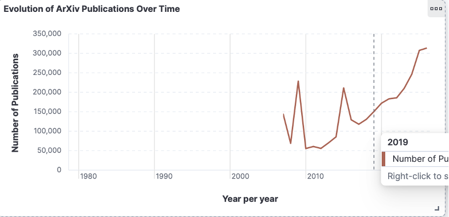
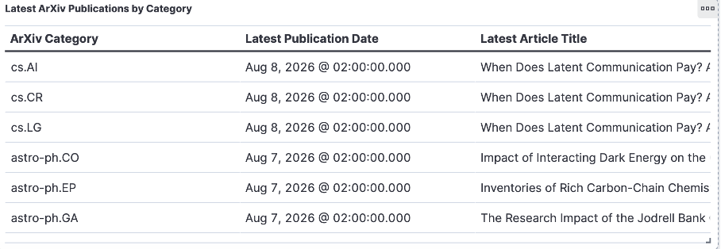

# Analyse de la qualité des données — SciPulse Insights

## 1. Objectif

Avant les transformations Silver et les traitements analytiques, une phase de profiling et de validation est appliquée aux données Bronze.

Cette étape permet d'identifier les valeurs manquantes, les doublons, les incohérences de types et les problèmes de qualité propres aux trois sources utilisées :

- ArXiv ;
- OpenAlex ;
- Hacker News.

Les contrôles sont réalisés à l'aide de scripts Python de profiling et de suites de validation Great Expectations.

---

## 2. Profiling des données Bronze

### 2.1 ArXiv

Le profiling ArXiv est réalisé sur un échantillon de **10 000 publications**.

Les résultats obtenus sont :

| Indicateur | Résultat |
|---|---:|
| Lignes analysées | 10 000 |
| Lignes JSON invalides | 0 |
| IDs dupliqués | 0 |
| `license` manquant | 92,87 % |
| `report-no` manquant | 91,17 % |
| `journal-ref` manquant | 45,66 % |
| `doi` manquant | 36,37 % |
| `comments` manquant | 11,38 % |

Les champs indispensables au pipeline, notamment les identifiants, titres, résumés et catégories, sont présents dans l'échantillon analysé.

Les catégories les plus représentées comprennent notamment `astro-ph`, `hep-th`, `hep-ph`, `quant-ph` et `gr-qc`.

---

### 2.2 OpenAlex

Le profiling OpenAlex est réalisé sur **50 000 publications**.

| Indicateur | Résultat |
|---|---:|
| Enregistrements | 50 000 |
| OpenAlex ID manquant | 0 |
| Titre manquant | 53 |
| DOI manquant | 3 532 |
| ArXiv ID manquant | 4 875 |
| Citation count manquant | 0 |
| Couverture DOI | 92,94 % |
| Couverture ArXiv ID | 90,25 % |
| Couverture citation count | 100 % |
| OpenAlex IDs dupliqués | 0 |
| ArXiv IDs dupliqués | 1 103 |
| DOI dupliqués | 1 092 |
| Citations négatives | 0 |

Les années de publication observées sont comprises entre **1984 et 2026**.

La présence de plusieurs occurrences d'un même identifiant ArXiv est prise en compte lors des traitements ultérieurs et ne remet pas en cause l'unicité des identifiants OpenAlex.

---

### 2.3 Hacker News

Le profiling Hacker News est réalisé sur **10 000 enregistrements Bronze**.

| Indicateur | Résultat |
|---|---:|
| Lignes analysées | 10 000 |
| JSON invalides | 0 |
| IDs dupliqués | 5 409 |
| `text` manquant | 92,69 % |
| `kids` manquant | 71,63 % |
| `url` manquant | 3,92 % |
| Type observé | `story` |

Les doublons sont principalement liés au fonctionnement de l'ingestion par micro-batches : un même item Hacker News peut être récupéré dans plusieurs lots successifs.

Ils sont supprimés lors du passage en Silver en conservant une seule occurrence par identifiant.

---

## 3. Validation avec Great Expectations

Des suites Great Expectations sont appliquées aux données Bronze afin de vérifier automatiquement les principales règles de qualité avant leur transformation.

### 3.1 Validation ArXiv

La validation ArXiv contrôle notamment :

- la présence et l'unicité de l'identifiant ;
- la présence du titre ;
- la présence de l'abstract ;
- la présence des catégories ;
- la présence et le format de `update_date`.

**Résultat : 7 expectations sur 7 validées — 100 %.**

---

### 3.2 Validation OpenAlex

La validation OpenAlex contrôle notamment :

- la présence et l'unicité de l'identifiant OpenAlex ;
- la présence du nombre de citations ;
- l'absence de valeurs négatives pour les citations ;
- la présence et la cohérence de l'année de publication.

**Résultat : 6 expectations sur 6 validées — 100 %.**

---

### 3.3 Validation Hacker News

La validation Hacker News contrôle notamment :

- la présence et le type de l'identifiant ;
- la présence du titre ;
- la présence et le type du timestamp ;
- le type d'item attendu (`story`) ;
- la présence de l'auteur ;
- la présence du score.

**Résultat : 9 expectations sur 9 validées — 100 %.**

---

Les trois sources passent ainsi les contrôles Great Expectations définis pour le pipeline avant leur transformation vers la couche Silver.

---

## 4. Nettoyage Bronze → Silver

Après le profiling et les contrôles de qualité, les données Bronze sont nettoyées et normalisées avant leur utilisation par Spark.

### 4.1 ArXiv

Le nettoyage ArXiv comprend la normalisation des champs, des catégories et des dates, ainsi que le traitement des identifiants invalides et des doublons.

Les données nettoyées sont enregistrées au format Parquet dans MinIO.

### 4.2 OpenAlex

Les données OpenAlex sont normalisées afin de faciliter leur jointure avec ArXiv. Les DOI, les identifiants ArXiv, les dates et les métriques de citations sont notamment normalisés.

### 4.3 Hacker News

Les données Hacker News sont nettoyées et dédupliquées afin de supprimer les répétitions provenant des différents micro-batches. Les timestamps et les principales valeurs numériques sont également normalisés.

---

## 5. Statistiques descriptives et visualisations

L'analyse descriptive permet d'observer la répartition et l'évolution des publications scientifiques ArXiv.

Les visualisations montrent notamment :
- les catégories ArXiv les plus représentées ;
- l'évolution du nombre de publications au fil des années ;
- les publications les plus récentes par catégorie.

### Interprétation

Les visualisations montrent une répartition inégale des publications entre les différentes catégories ArXiv, certaines catégories concentrant un volume nettement plus important de publications.

L'analyse temporelle met également en évidence une augmentation globale du nombre de publications au cours des dernières années.