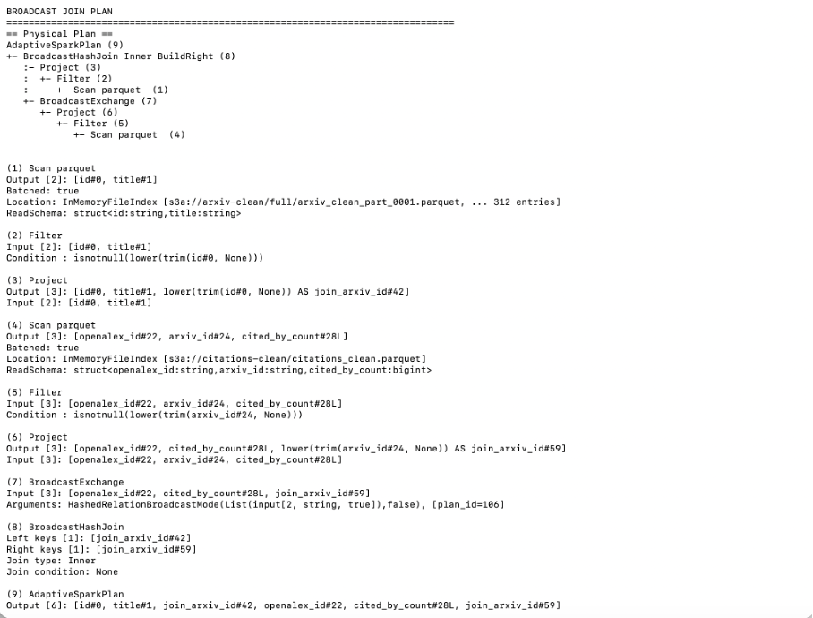
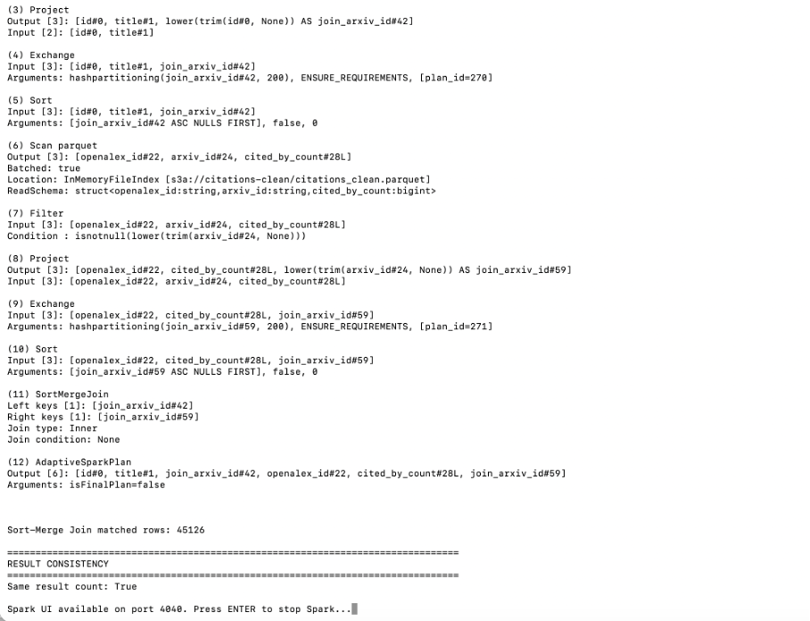
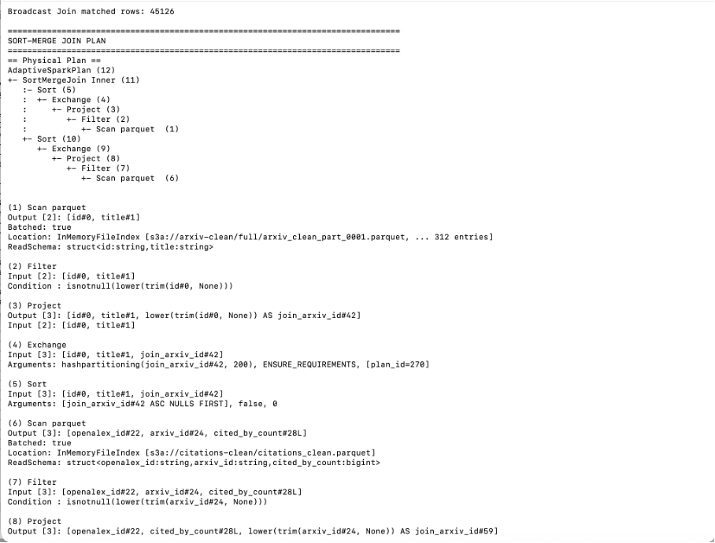
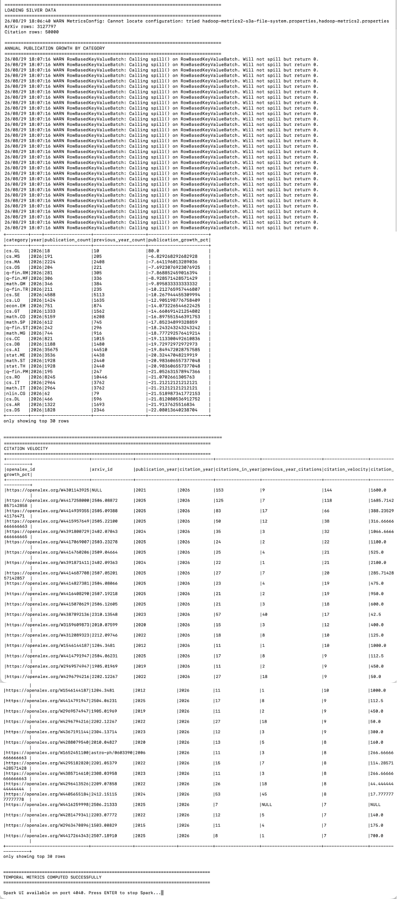
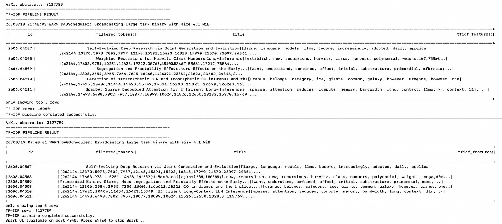

# Pipeline Spark — SciPulse Insights

## 1. Objectif

Apache Spark est utilisé dans **SciPulse Insights** pour croiser et analyser les données nettoyées de la couche Silver.

Le pipeline exploite trois sources complémentaires :

- **ArXiv** : publications scientifiques, métadonnées et abstracts ;
- **OpenAlex** : données de citations utilisées comme mesure d'impact académique ;
- **Hacker News** : signal complémentaire représentant l'intérêt communautaire autour de certaines publications.

Les données Silver sont stockées au format **Parquet dans MinIO** et sont directement chargées par Spark via le protocole S3A.

---

## 2. Choix de la source de citations

**OpenAlex** a été retenu comme source de citations afin d'enrichir les publications ArXiv avec des informations d'impact académique.

La correspondance entre les deux sources repose sur l'identifiant :

`arxiv_id`

Le champ `cited_by_count` fourni par OpenAlex permet ensuite de mesurer le nombre de citations associées à une publication.

Hacker News est utilisé en complément afin d'identifier les publications ayant également suscité de l'intérêt dans la communauté technologique.

---

## 3. Stratégie de jointure Spark

Avant les jointures, les identifiants ArXiv sont normalisés afin d'obtenir une clé commune entre les différentes sources.

Lors du test des stratégies de jointure, Spark a traité :

- **3 127 797 publications ArXiv** ;
- **45 125 lignes OpenAlex**.

Deux stratégies de jointure ont été comparées avec les plans physiques générés par Spark.

### Broadcast Hash Join

Le premier test utilise un **Broadcast Hash Join**.

Le plan d'exécution Spark confirme notamment :

`BroadcastHashJoin Inner BuildRight`

ainsi que la présence d'un `BroadcastExchange`.

*Figure 1 — Plan physique Spark utilisant un Broadcast Hash Join.*

Cette stratégie permet de diffuser le dataset le plus petit afin d'éviter certaines opérations coûteuses de repartitionnement et de tri.

### Sort-Merge Join

La même jointure a également été testée avec un **Sort-Merge Join**.

Le plan physique fait apparaître un :

`SortMergeJoin Inner`

ainsi que des opérations `Exchange` et `Sort`.

*Figure 2 — Plan physique Spark utilisant un Sort-Merge Join.*

Les deux stratégies produisent le même résultat :

| Stratégie | Nombre de lignes |
|---|---:|
| Broadcast Hash Join | 45 126 |
| Sort-Merge Join | 45 126 |

Le test confirme également :

`Same result count: True`

Les deux stratégies sont donc fonctionnellement équivalentes sur ces données, mais leur plan d'exécution diffère. Le Broadcast Join est particulièrement pertinent lorsqu'un des datasets est suffisamment petit pour être diffusé en mémoire.

---

## 4. Indicateurs temporels et Window Functions

Spark est également utilisé pour calculer des indicateurs temporels.

Deux métriques principales sont produites :

- la **croissance annuelle du nombre de publications par catégorie ArXiv** ;
- la **vélocité des citations** d'une publication au fil des années.

Ces calculs utilisent les **Window Functions de Spark**, notamment `partitionBy()`, `orderBy()` et `lag()`.

Pour la croissance des publications, les données sont partitionnées par catégorie et ordonnées par année. La fonction `lag()` permet de récupérer le nombre de publications de l'année précédente et de calculer le taux d'évolution.

Pour la vélocité des citations, le même principe est appliqué aux données OpenAlex afin de comparer le nombre de citations d'une publication entre deux années.

*Figure 3 — Calcul des indicateurs temporels avec les Window Functions Spark.*

Cette approche permet de réaliser les calculs directement de manière distribuée sur les données Silver.

---

## 5. Pipeline TF-IDF

Un pipeline **TF-IDF** est implémenté avec Spark ML afin d'analyser le contenu textuel des abstracts ArXiv.

Le traitement suit quatre étapes principales :

1. **Tokenisation** avec `RegexTokenizer` : l'abstract est découpé en mots, convertis en minuscules et les tokens trop courts sont ignorés.
2. **Suppression des stop words** avec `StopWordsRemover` afin d'éliminer les mots courants peu discriminants.
3. **Calcul du Term Frequency** avec `HashingTF`, qui transforme les tokens en vecteurs numériques de fréquence.
4. **Calcul de l'IDF** avec `IDF`, afin de donner davantage de poids aux termes spécifiques à un document et moins de poids aux termes très fréquents dans l'ensemble du corpus.

Le nombre de caractéristiques utilisé par `HashingTF` est :

`262 144` (`2^18`)

Le pipeline produit notamment les colonnes :

- `filtered_tokens`
- `tf_features`
- `tfidf_features`

Le traitement a été validé sur un sous-ensemble de données, puis exécuté sur le corpus complet.

L'exécution complète a traité :

**3 127 789 abstracts ArXiv**

et s'est terminée avec succès.

*Figure 4 — Exécution du pipeline TF-IDF Spark sur les abstracts ArXiv.*

L'utilisation de Spark ML permet ainsi d'appliquer un traitement textuel distribué à plusieurs millions de publications sans charger l'ensemble du corpus dans un traitement local unique.

---

## 6. Score d'impact composite

Le score d’impact développé dans **SciPulse Insights** vise à mesurer l’importance d’une publication scientifique en combinant trois dimensions complémentaires : son impact académique, sa visibilité auprès de la communauté technique et sa récence.

Le score final est calculé selon la formule suivante :

**Score d’impact = 100 × (0,50 × Citations + 0,30 × Hacker News + 0,20 × Récence)**

Les trois composantes sont préalablement normalisées entre **0 et 1** afin de pouvoir les combiner malgré leurs échelles différentes.

### Citations académiques — 50 %

Les citations constituent le signal principal du score, car elles représentent la reconnaissance et l’influence d’une publication au sein de la communauté scientifique.

Le nombre de citations provenant d’OpenAlex est transformé selon :

`log(1 + nombre_de_citations)`

Cette transformation logarithmique permet de limiter l’influence des publications ayant un nombre exceptionnellement élevé de citations, tout en conservant leur importance relative.

Le poids de **50 %** permet donc de conserver l’impact scientifique comme composante principale du classement.

### Signal Hacker News — 30 %

Le signal Hacker News permet de mesurer la visibilité d’une publication auprès d’une communauté davantage orientée technologie et innovation.

Il combine le score obtenu par une publication sur Hacker News et le nombre de commentaires associés :

`log(1 + hn_score_total + hn_descendants_total)`

Une transformation logarithmique est également utilisée afin qu’un article devenu viral sur Hacker News ne domine pas à lui seul le score final.

Le poids de **30 %** permet de donner une importance significative à l’intérêt communautaire tout en maintenant les citations académiques comme critère principal.

### Récence — 20 %

La récence permet de ne pas favoriser systématiquement les publications anciennes, qui ont naturellement eu davantage de temps pour accumuler des citations.

Elle est calculée à partir de la date de publication initiale ArXiv :

`Récence = 1 / (1 + âge_en_jours / 365)`

Ainsi, une publication récente obtient une valeur proche de **1**, puis son score diminue progressivement avec le temps.

Le poids de **20 %** permet de valoriser les travaux émergents sans donner davantage d’importance à leur nouveauté qu’à leur impact scientifique réel.

### Justification des pondérations

Le choix **50 % / 30 % / 20 %** reflète l’objectif de SciPulse Insights : privilégier l’impact scientifique établi, tout en intégrant la visibilité actuelle d’une publication et sa récence.

Les citations restent donc le facteur dominant (**50 %**), Hacker News apporte un indicateur complémentaire d’intérêt auprès de la communauté technologique (**30 %**) et la récence (**20 %**) permet de faire émerger des travaux récents qui n’ont pas encore eu le temps d’accumuler beaucoup de citations.

> **Précision méthodologique :** le score est calculé uniquement pour les publications ArXiv disposant d’une correspondance avec les données OpenAlex ingérées. Une publication absente de l’échantillon OpenAlex n’est donc pas considérée artificiellement comme ayant zéro citation.

---

## 7. Résultat du pipeline

Après les traitements Spark, les publications enrichies sont envoyées vers la couche **Gold**, puis indexées dans Elasticsearch pour alimenter les dashboards Kibana.

Le pipeline suit ainsi le flux suivant :

`Silver (MinIO) → Spark → Jointures & analyses → Impact Score → Gold → Elasticsearch → Kibana`

Le dataset Gold final contient **44 022 publications enrichies**.

Cette implémentation permet ainsi de combiner traitement distribué, optimisation des jointures, Window Functions, analyse TF-IDF et construction d'un indicateur analytique directement exploitable dans les dashboards.