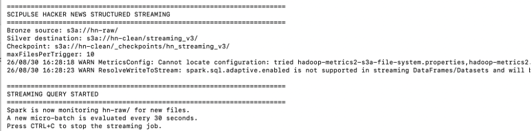

# Extension — Structured Streaming Hacker News

## 1. Objectif

Une extension Spark Structured Streaming a été mise en place afin de traiter progressivement les nouvelles données Hacker News déposées dans la couche Bronze.

L'objectif est de compléter le pipeline batch principal par un traitement incrémental capable de détecter et transformer de nouveaux fichiers.

## 2. Implémentation

Le traitement est réalisé avec Spark Structured Streaming dans :

`src/spark/hn_streaming.py`

Le flux lit les nouvelles données depuis :

`s3a://hn-raw/`

Les données transformées sont écrites dans :

`s3a://hn-clean/streaming/`

Un mécanisme de checkpoint est utilisé afin de conserver l'état du traitement :

`s3a://hn-clean/_checkpoints/hn_streaming_v2/`

Le streaming est configuré avec un déclenchement toutes les 30 secondes et traite au maximum 10 nouveaux fichiers par déclenchement.

## 3. Choix techniques

Cette extension utilise directement les fichiers déposés dans MinIO comme source de streaming.

Ce choix permet de rester cohérent avec l'architecture Medallion du projet et de réutiliser l'infrastructure existante sans introduire un composant supplémentaire comme Kafka.

Le traitement streaming est isolé du traitement Silver batch afin d'éviter toute modification du pipeline principal.

## 4. Validation de l'extension

Le job Spark Structured Streaming a été lancé afin de surveiller le bucket Bronze Hacker News.

La sortie du job confirme le démarrage de la requête streaming, la surveillance de `hn-raw/`, l'utilisation du checkpoint et l'exécution d'un micro-batch toutes les 30 secondes.

Des fichiers de test ont également été ajoutés au bucket Bronze `hn-raw` afin de vérifier leur disponibilité pour le traitement incrémental.

La présence de ces fichiers dans MinIO permet de confirmer leur ingestion dans la couche Bronze utilisée comme source par Structured Streaming.

## 5. Limite rencontrée

Lors de certains redémarrages du job Structured Streaming, la reprise depuis le checkpoint stocké dans MinIO peut échouer lorsqu'un fichier d'état attendu par Spark n'est plus disponible.

Cette limite concerne la gestion du state store Spark avec le stockage S3A/MinIO. Elle n'affecte pas le pipeline batch principal du projet, qui reste indépendant de cette extension.

Cette extension est donc présentée comme une expérimentation complémentaire au pipeline principal.

## 6. Conclusion

Cette extension démontre l'utilisation de Spark Structured Streaming pour surveiller l'arrivée de nouvelles données Hacker News dans l'architecture SciPulse Insights.

Elle complète le pipeline batch principal et permet d'explorer une approche de traitement incrémental tout en réutilisant l'infrastructure MinIO et Spark existante.