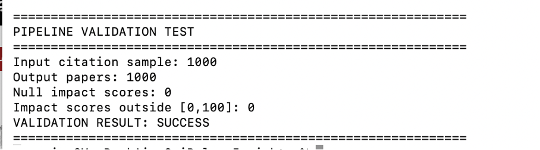
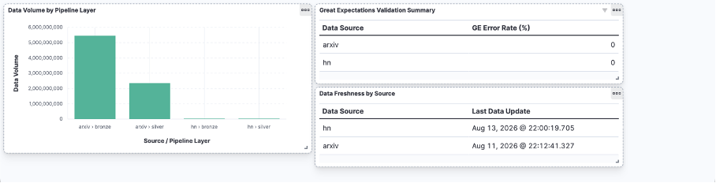
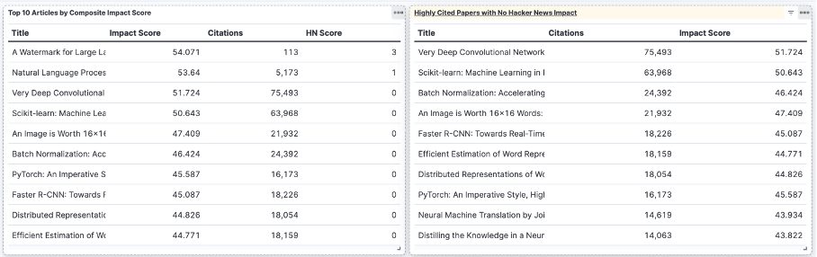
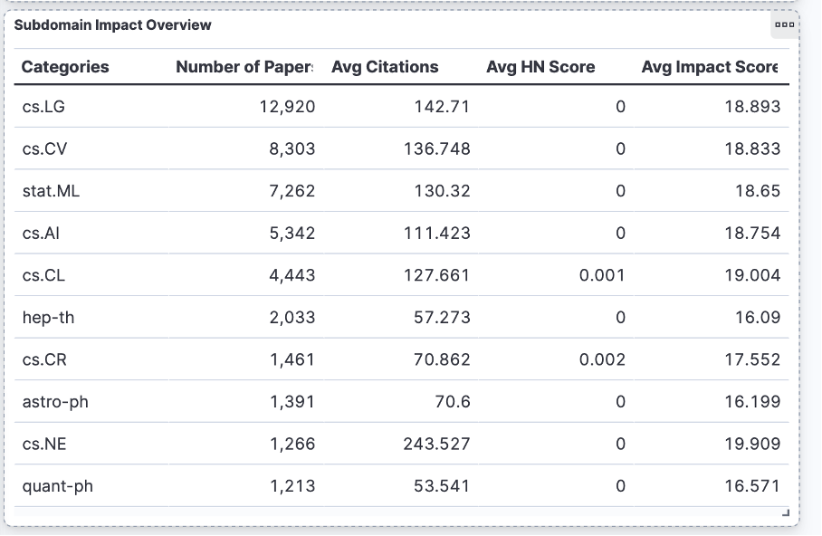
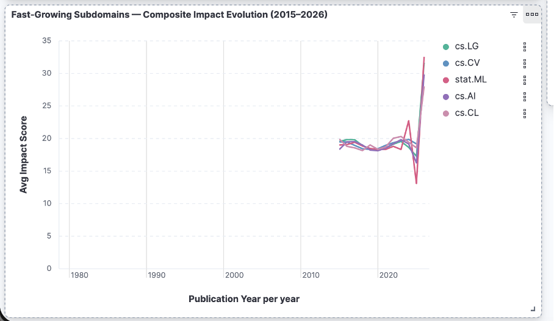

# Validation du pipeline — SciPulse Insights

## 1. Objectif

La validation a pour objectif de vérifier que le pipeline produit des résultats cohérents à partir de données représentatives des trois sources utilisées : ArXiv, OpenAlex et Hacker News.

La validation porte sur deux aspects :

- la qualité et la cohérence des données traitées ;
- la capacité des dashboards Kibana à répondre aux principaux besoins analytiques du projet.

## 2. Validation sur échantillons de données

Des échantillons représentatifs des trois sources sont utilisés pour vérifier la qualité des données avant l'exécution des traitements complets.

Les contrôles Great Expectations valident les principales contraintes définies pour chaque source :

- ArXiv : 7 expectations sur 7 validées ;
- OpenAlex : 6 expectations sur 6 validées ;
- Hacker News : 9 expectations sur 9 validées.

Ces résultats montrent que les règles de qualité définies sont applicables aux différentes sources avant leur transformation.

## 3. Validation du résultat du pipeline

Un test de validation a été réalisé sur un sous-ensemble de **1 000 publications** afin de vérifier le comportement du pipeline sur un échantillon distinct du traitement complet.

Le pipeline a produit **1 000 publications en sortie**, sans score d'impact nul et sans valeur en dehors de l'intervalle attendu `[0,100]`.

**Résultat : validation réussie.**

Sur le traitement complet, le pipeline aboutit à **44 022 publications uniques** enrichies et exploitables pour les analyses finales.

Les détails des transformations Spark et du calcul du score d'impact sont présentés dans `docs/spark_pipeline.md`.

## 4. Validation des dashboards Kibana

Les dashboards Kibana permettent de vérifier que les données produites par le pipeline répondent aux principaux besoins analytiques du projet.

### 4.1 Monitoring du pipeline

Le dashboard de monitoring permet de suivre les volumes de données entre les couches Bronze et Silver, les résultats des contrôles Great Expectations ainsi que la fraîcheur des données.

### 4.2 Classement par impact

Le dashboard permet d'identifier les publications ayant les scores d'impact les plus élevés et de comparer l'influence des citations académiques et de Hacker News.

### 4.3 Analyse par sous-domaine

Les publications peuvent être comparées par catégorie ArXiv selon leur volume, leur nombre moyen de citations et leur score d'impact moyen.

### 4.4 Évolution temporelle

Le dashboard permet également de suivre l'évolution du score d'impact moyen des principaux sous-domaines au fil des années.

## 5. Conclusion

Les validations réalisées confirment que les données respectent les contrôles de qualité définis et que le pipeline produit des données exploitables pour l'analyse.

Les dashboards Kibana permettent de répondre aux principales requêtes analytiques du projet : suivi de la qualité des données, identification des publications à fort impact, comparaison des sous-domaines et analyse de leur évolution temporelle.